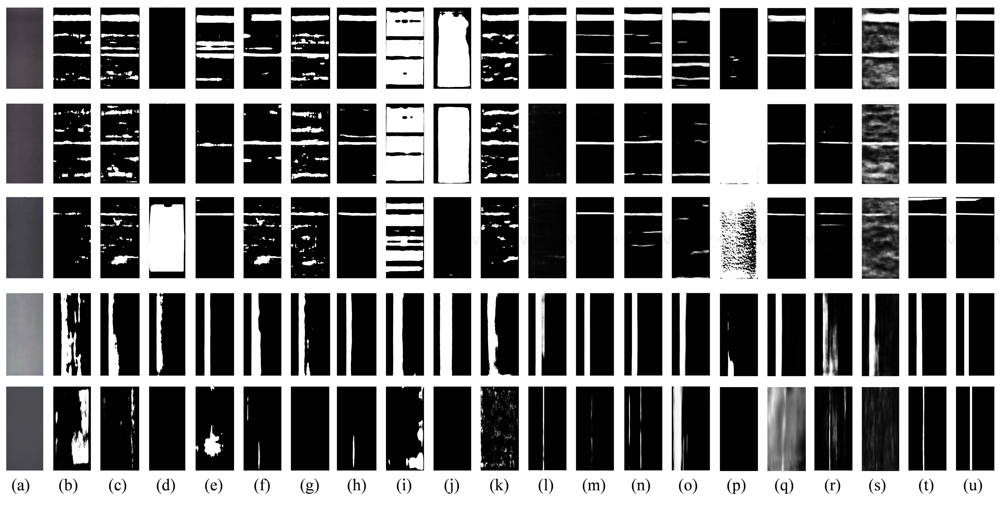

# MS-MuraNet
MS-MuraNet: Knowledge-Driven Multi-scale Feature Enhancement Network for Detection of Mura Defects in OLED

# 
> **Abstract:** Mura defects in OLED displays pose significant quality control challenges in manufacturing environments due to their uneven brightness, lacking of distinct shapes and blurred boundaries. Such defects become particularly difficult to detect under complex lighting conditions typical in automated industrial inspection processes. To solve this problem within industrial automation environment, this paper proposes a knowledge-driven multi-scale feature enhancement network for detection of mura defects in OLED. MS-MuraNet integrates explicit domain knowledge using three innovative strategies. First, the original image is transformed into pseudo-thermal representations and histograms to extract defect features across multiple domains. Then, a channel attention enhancement module, a dual-path feature fusion enhancement module and a weak target enhancement module are presented to improve the detection of low-contrast regions while delivering region-aware and contour-aware features crucial for automated defect classification. Finally, an edge refinement attention module is proposed to address the practical challenge of capturing fine edge details critical to ensure quality in precision manufacturing. In addition, a hybrid loss function is introduced to capture both feature and structural information of images from multiple perspectives, enhancing the model’s sensitivity to blurred boundaries and low-contrast regions. Extensive experimental results demonstrate that the proposal method consistently outperforms 18 benchmark segmentation and salient object detection methods, addressing the industry's critical requirement for high-precision quality control.

<div align="center">
  <p>
        
    </a>
</p>
</div>


# ⚙️ Installation  
This codebase was tested with the following environment configurations:

- Ubuntu 20.04
- CUDA 11.8
- Python 3.8
- PyTorch 1.11.0 + cu113

# 🔥 Training  
1. Please download the corresponding training datasets and put them in the folder.
2. Please run the `prepare.py` and then save the obtained image to a separate folder.
3. Begin training our model.
```
python Train.py
```

# 🔥 Testing
1. Please download the corresponding testing datasets and put them in the other folder.
2. Please check the `checkpoint.pth.tar` file.
3. Begin testing our model.
```
python Test.py
```

# Citation  
